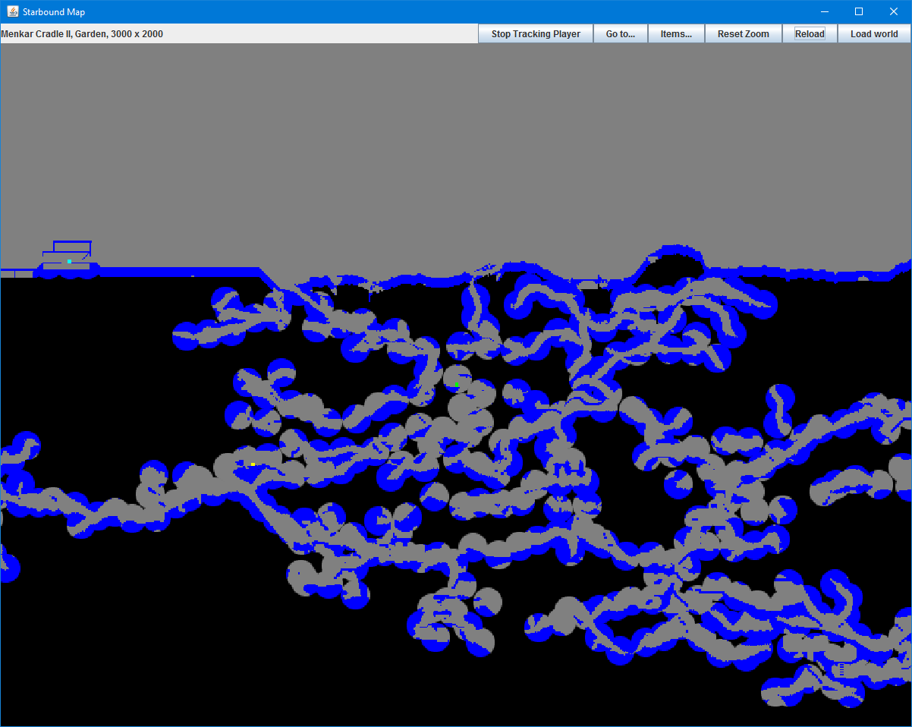

Starbound Minimap Application
=============================

How It Works
------------
The application reads the saved world data and player data and generates a map image.
It reveals the portions of the map that are near the surface and around torches.
This allows you to mark your way underground and see where you've been in the map.

Starbound does not appear to save map data until you actually click "Save & Quit" in the
menu, so unfortunately the map doesn't update in real time.

### Player Tracking
Player tracking works by reading the player's location directly from Starbound's process memory.
This works with Starbound version 1.05 for Windows x86_64, and will probably not work with other versions.

Map Legend
----------
- Foreground material is blue.
- With player tracking on, the player is a green rectangle in the middle.
- Items are yellow squares. You can center the map on specific items with the "Items..." button.
- Flags are cyan squares. You can center the map on specific flags with the "Go to..." button.
- The player start location in the world is the red rectangle. You can center the map on the start locaiton with the "Go to..." button.

Acknowledgments
---------------
Reading the map data is based on the excellent work by Blixt:
https://github.com/blixt/py-starbound
